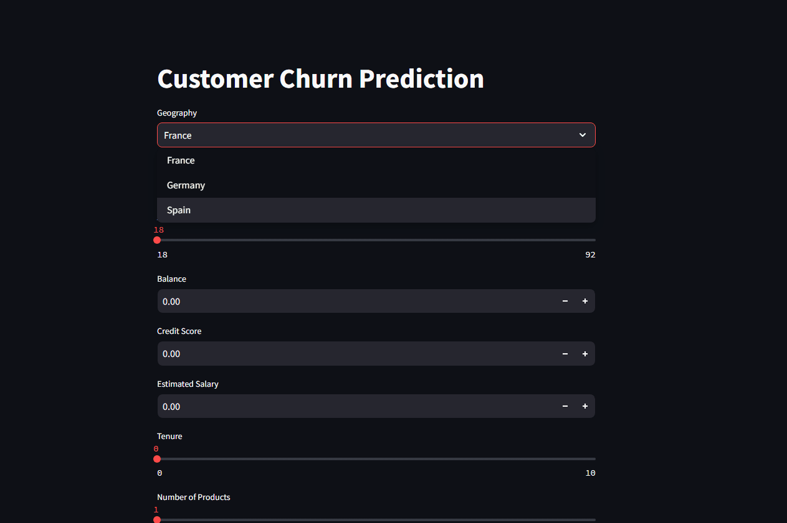

# Bank Customer Analytics ML

A comprehensive machine learning project that performs both customer churn prediction and salary estimation using Artificial Neural Networks (ANN). Both models are deployed as interactive web applications using Streamlit.

## Project Overview

This project uses deep learning models to:
1. Predict whether a bank customer is likely to leave the bank (churn)
2. Estimate a customer's salary 
based on various features like credit score, geography, gender, age, tenure, balance, etc.

## Demo


## Features

- Two Deep Learning models built with TensorFlow/Keras:
  - Classification model for churn prediction
  - Regression model for salary estimation
- Interactive web interfaces built with Streamlit
- Support for various customer attributes:
  - Credit Score
  - Geography (France, Spain, Germany)
  - Gender
  - Age
  - Account Balance
  - Number of Products
  - Credit Card Status
  - Active Member Status
  - Estimated Salary
- Real-time predictions with probability scores for churn
- Accurate salary estimations

## Project Structure

```
├── Classification.py       # Streamlit app for churn prediction
├── Regression.py          # Streamlit app for salary prediction
├── requirements.txt       # Project dependencies
├── Artifacts/            # Saved models and encoders
│   ├── classification/   # Classification model artifacts
│   │   ├── model.h5
│   │   ├── scaler.pkl
│   │   ├── label_encoder_gender.pkl
│   │   └── onehot_encoder_geo.pkl
│   └── regression/      # Regression model artifacts
│       ├── regression_model.h5
│       ├── scaler.pkl
│       ├── label_encoder_gender.pkl
│       └── onehot_encoder_geo.pkl
├── data/
│   └── Churn_Modelling.csv # Training dataset
├── notebooks/
│   ├── Classification/
│   │   ├── experiments.ipynb
│   │   └── prediction_test.ipynb
│   └── Regression/
│       └── Salaryregression.ipynb
└── logs/                 # TensorBoard logging directory
```

## Installation

1. Clone the repository:
```sh
git clone https://github.com/OmarAshry1/Bank-Customer-Analytics-ML.git
cd Bank-Customer-Analytics-ML
```

2. Install dependencies:
```sh
pip install -r requirements.txt
```

## Usage

Run either of the Streamlit apps:

For Churn Prediction:
```sh
streamlit run Classification.py
```

For Salary Estimation:
```sh
streamlit run Regression.py
```

## Model Architectures

### Classification Model (Churn Prediction)
- Input Layer: 11 features
- Hidden Layer 1: 64 neurons with ReLU activation
- Hidden Layer 2: 32 neurons with ReLU activation 
- Output Layer: 1 neuron with Sigmoid activation

### Regression Model (Salary Prediction)
- Input Layer: 11 features
- Hidden Layer 1: 64 neurons with ReLU activation
- Hidden Layer 2: 32 neurons with ReLU activation 
- Output Layer: 1 neuron (linear activation)

## Model Performance

### Classification Model
- Training Accuracy: 87%
- Validation Accuracy: 86%
- Early stopping used to prevent overfitting
- Loss function: Binary Cross-Entropy
- Optimizer: Adam with learning rate 0.01

### Regression Model
- Mean Absolute Error (MAE) on test set
- Early stopping used to prevent overfitting
- Loss function: Mean Squared Error
- Optimizer: Adam

## Technologies Used

- Python 3.12
- TensorFlow 2.x
- Pandas
- NumPy
- Scikit-learn
- Streamlit
- TensorBoard

## Author

Omar

